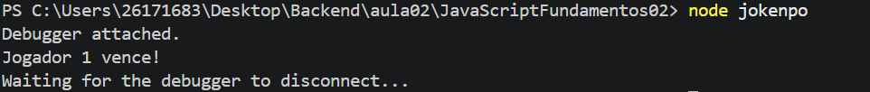

# JavaScript - Condições e Laços de Repetição

## Objetivos

Ao final dessa aula, o aluno será capaz de:

* Compreender como funciona estruturas condicionais.
* Utilizar operadores de comparação e operadores lógicos.
* Desenvolver algoritimos utilizando `if`, `else`, e `else if`.
* Utilizar a estrtura `switch`.
* Criar repetições utilizando `for`, `while` e `do...while`.
* Resolver problemas utilizando lógica de programação.

---

## Conteúdo

### Estruturas condicionais

* if
* else
* else if
* switch* Operadores de comparação
* Operadores lógicos

### Laços de Repetição

* for
* while
* do...while
* break
* continue

### Arrays

* push() Adiciona ao final
* pop() Remove o último
* unshift() Adiciona ao início
* shift() Remove o primeiro
* leght Quantidade de elementos
* at() Acessa uma posição

## Como executar

```bash
    git clone "https://github.com/abacaki/JavaScriptFundamentos02.git"
```

Entre na pasta
 
```bash
    cd JavaScriptFundamentos02
```

Execute qualquer arquivo JavaScript

```bash
    node jokenpo.js
```

## Resultado



## Exemplos desenvolvidos

Durante a aula foram implementados os exemplos como:
* Verificar a Maioridade.
* Calcular aprovação do aluno.
* Classificar idade.
* Menu utilizando switch.
* Contagem crescente.
* Contagem decrescente.
* Contagem regressiva.

## Exercícios

* Estruturas condicionais.
* Operadores lógicos.
* Estrutura de repetição
* Problemas utilizando lógica de programação
* Desafio final integrando todos os conceitos estudados.

## Tecnologias

* JavaScript (ES2023).
* Node.js.
* Visual Studio Code.

## Competência desenvolvida

* Lógica de Programação.
* Tomada de decisão.
* Estruturas condicionais.
* Organização de algoritmos.
* Resolução de problemas

## Material de apoio

* JavaScript.
* Node.js.
* MON Web Docs.